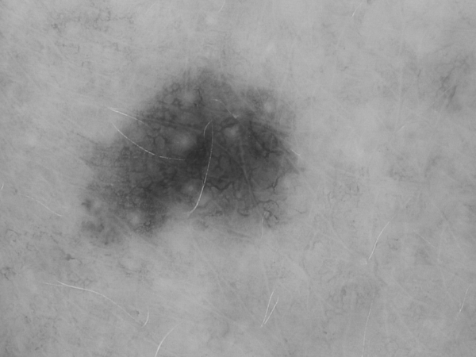

# OpenCV Lesion Analysis Example

A minimal example that combines an OpenCV MCP tool server with an AutoGen assistant agent to perform basic dermatology lesion image analysis (segmentation + measurements) and optional interactive Q&A.

Note that segmentation and especially measurement performance is currently quite poor, but this is intended as a simple starting point for building image-centric agent workflows.

Example input image:

[](./data/HAM10000_images_part_1/ISIC_0029236_gray.jpg)

## What It Does

1. Launches the `opencv-mcp-server` (via `uv run`) and dynamically discovers its tools.
2. Sends an initial task to segment the lesion in the provided image (largest connected component of inverted threshold result). OpenCV seems to save intermediary and result JPGs in the `data/HAM10000_images_part_1` and sometimes in the root folder.
3. Reports key quantitative metrics: center position, pixel area, major/minor diameters, and mean gray value (0–1 scale).
4. (Optional) Enters an interactive loop so you can ask follow‑up questions about the image or derived data.

## Requirements

- Python (compatible with `uv` – typically 3.11+)
- `uv` installed (https://github.com/astral-sh/uv)
- OpenAI or Azure OpenAI API key set as one of `OPENAI_API_KEY` or `AZURE_OPENAI_API_KEY` (loaded via `.env` if present), or access to a local ollama server with a suitable model (changed in `load_model_config()`).
- Packages specified in the project `pyproject.toml` / `uv.lock`
- `opencv-mcp-server` (fetched automatically by `uv run opencv-mcp-server`)
- **Probably: A patched FastMCP** - Due to a version incompatibility, you currently (opencv-mcp-server 0.1.1 with latest FastMCP) need to patch ``mcp.server.fastmcp.server.FastMCP.__init__`` to add a description parameter ``description: str | None = None,``so that the openCV MCP server works.

## Quick Start

```bash
# From opencv_example directory
uv run main.py
```

Add `--interactive` to enter chat mode after the initial analysis.

On Windows PowerShell you can also run:

```powershell
uv run main.py --interactive
```

(Default image path is already set; pass a different one with `--image <path>`.)

## Output

- Console logs list available MCP tools and the generated analysis messages.
- A segmentation visualization JPG is saved alongside the script (name includes timestamp and descriptors).

## Customization

- Use a different model by modifying the `load_model_config()` function in `main.py`.
- Modify the initial system prompt in `main.py` (`system_message`) to change assistant behavior.
- Adjust segmentation strategy by editing the initial task string (`initial_task`).
- Limit or expand tool iterations via `max_tool_iterations` in the `AssistantAgent` constructor.

## Troubleshooting

- If you see an API key error, ensure `.env` contains `OPENAI_API_KEY=` (or Azure equivalents) or export it in your shell.
- File not found: verify the `--image` path (relative to repo root) or supply an absolute path.
- Tool discovery issues: confirm `uv` is installed and on PATH; try running `uv run opencv-mcp-server --help` manually.

